# 🗲 ZTAP V1.0: Zero-Knowledge Terminal Architecture & Protocol

**ZTAP (Zero-Knowledge Terminal Architecture & Protocol)** is a high-security, volatile communication framework designed to operate over untrusted infrastructure (Tor Hidden Services, Blind Relays, or Compromised Nodes). 

The system ensures absolute confidentiality and mathematical immunity against forensic analysis, preventing data persistence at every layer of the stack.

---

## 🏗️ Protocol Topology & Data Flow

```mermaid
graph LR
    subgraph "CLIENT A (Browser)"
    A[WebCrypto Engine] --> B[PBKDF2 600k Iterations]
    B --> C[AES-256-GCM Encrypt]
    C --> D[4096B Strict Padding]
    end

    D -- "Encrypted Envelope (Tor/Onion)" --> E

    subgraph "BLIND RELAY (Node.js Server)"
    E[Memory-Only Buffer] --> F[Zero-Persistence Vault]
    F -- "Broadcast" --> G
    end

    G -- "Constant Bitrate Stream" --> H

    subgraph "CLIENT B (Admin/User)"
    H[Strict Frame Parsing] --> I[Web Worker Isolation]
    I --> J[AES-256-GCM Decrypt]
    J --> K[Volatile Memory Purge]
    end
```

---

## 🔒 Security Core (Hardening Features)

### 1. Autonomous Cryptographic Engine
The protocol implements a double-layered encryption stack using the native **WebCrypto API**, eliminating third-party library dependencies and mitigating supply chain attacks.
*   **Key Exchange:** RSA-OAEP (4096-bit) with SHA-256.
*   **Stream Security:** AES-256-GCM with unique Initialization Vectors (IV) per frame.
*   **Signature Scheme:** **RSA-PSS** (Probabilistic Signature Scheme) with 32-byte salt for identity verification (Admin Command & Control).
*   **Identity Derivation:** PBKDF2-HMAC-SHA256 with **600,000 iterations** to ensure brute-force resistance.

### 2. Traffic Analysis Mitigation (DPI Defense)
*   **Strict Padding:** Every payload is packed into a fixed-size **4096-byte** binary ArrayBuffer. This nullifies length-based side-channel analysis.
*   **Stochastic Chaffing:** Asynchronous injection of synthetic noise frames via randomized timers to obfuscate temporal patterns.
*   **Proof of Work (PoW):** Implementation of SHA-256 based PoW challenges for `INIT` and message frames to prevent Asymmetric DoS attacks on the Admin node.

### 3. Volatile Anti-Forensics Layer
ZTAP is designed for **Zero-Persistence**.
*   **Memory Hygiene:** TypedArrays (`Uint8Array`) are used for plaintext processing and are sanitized using `.fill(0)` and CSPRNG noise injection immediately after use.
*   **Automatic 24h Purge:** The server implements a mandatory cleanup cycle that wipes the message vault (RAM and Disk) every 24 hours, ensuring ephemerality.
*   **Zero-Store Keys:** Session tokens and private keys never touch the server's disk; they reside only in the volatility of the browser's memory and the server's RAM during transport.

---

## 🛡️ Obfuscation & Dynamic Execution
The client-side logic is hardened through **AST (Abstract Syntax Tree) Obfuscation**:
*   **Non-linear State Machines:** Transformation of execution flow to frustrate reverse engineering.
*   **Dead Code Injection:** Polymorphic branches and dummy logic to increase the cost of manual analysis.
*   **Worker Integrity:** A `GOLD_HASH` (SHA-512) validation ensures the Web Worker hasn't been tampered with in transit.

---

## 🚀 Deployment (Onion Service)
The system is optimized for **Tor Hidden Services**:
1.  **Launcher:** Automates the instantiation of the local Tor binary and the Node.js relay.
2.  **Identity:** Generates a unique `.onion` address for anonymous access.
3.  **Governance:** Role-based access via RSA identity files (Master Key).

---

## ⚖️ Auditing Disclaimer
> *"A 100% secure system does not exist; there are only systems that are prohibitively expensive to hack."*

ZTAP is built on the principle of **Attack Cost Maximization**. By combining aggressive memory hygiene, traffic normalization, and deep obfuscation, the infrastructure forces adversaries to expend computational resources they are unlikely to invest for standard interception.

---
**Developed and Hardened by Noir0x63** 🔒🎩
