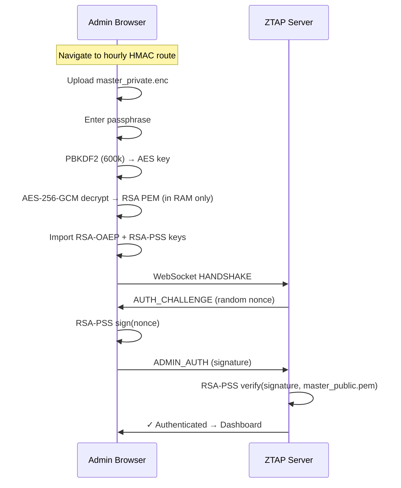

# 🗲 ZTAP V3.1: Zero-Knowledge Terminal Architecture & Protocol

[](https://github.com/Noir0x63/Terminal)
[]()
[]()
[]()
[]()
[-green.svg)]()

**ZTAP (Zero-Knowledge Terminal Architecture & Protocol)** is a high-security, volatile communication framework designed to operate over untrusted infrastructure (Tor Hidden Services, Blind Relays, or Compromised Nodes). 

The system ensures absolute confidentiality and mathematical immunity against forensic analysis, preventing data persistence at every layer of the stack.

---

## 🏗️ Protocol Topology & Data Flow

```mermaid
graph LR
    subgraph "CLIENT A (Browser)"
    A[WebCrypto Engine] --> B[PBKDF2 600k Iterations]
    B --> C[AES-256-GCM Encrypt]
    C --> D[4096B Strict Padding]
    end

    D -- "ECDH Ephemeral Channel (Tor/Onion)" --> E

    subgraph "BLIND RELAY (Node.js Server)"
    E[Memory-Only Buffer] --> F[Zero-Persistence Vault]
    F -- "Broadcast" --> G
    end

    G -- "Constant Bitrate Stream" --> H

    subgraph "CLIENT B (Admin/User)"
    H[Strict Frame Parsing] --> I[Web Worker Isolation]
    I --> J[AES-256-GCM Decrypt]
    J --> K[Volatile Memory Purge]
    end
```



---

## 🔒 Security Core (Hardening Features)

### 1. Autonomous Cryptographic Engine
The protocol implements a multi-layered encryption stack using the native **WebCrypto API**, eliminating third-party library dependencies and mitigating supply chain attacks.
*   **Key Exchange:** RSA-OAEP (4096-bit) with SHA-256 for identity authentication.
*   **Perfect Forward Secrecy:** ECDH (P-256) ephemeral keypair per session — compromising the master RSA key does **NOT** reveal historical traffic.
*   **Stream Security:** AES-256-GCM with unique Initialization Vectors (IV) per frame.
*   **Signature Scheme:** **RSA-PSS** (Probabilistic Signature Scheme) with 32-byte salt for identity verification (Admin Command & Control).
*   **Identity Derivation:** PBKDF2-HMAC-SHA256 with **600,000 iterations** and **high-entropy session salt** (32 bytes CSPRNG) to ensure brute-force resistance.

### 2. Encrypted-At-Rest Key Management
All cryptographic secrets are protected at rest — plaintext key material **never** persists on disk.
*   **Master Private Key:** Encrypted with AES-256-GCM, key derived via **PBKDF2** (600,000 iterations, SHA-256) from an admin passphrase. Stored as `master_private.enc`.
*   **Browser-Side Decryption:** The admin panel decrypts `master_private.enc` **entirely in the browser** using WebCrypto PBKDF2. The plaintext key exists only in volatile RAM — it never reaches the server.
*   **Admin HMAC Secret:** Derived deterministically from the admin passphrase via scrypt — no `admin_token.txt` file ever exists.
*   **Server Nonce:** A random 32-byte nonce generated per keygen cycle, adding entropy to admin route rotation and preventing prediction attacks.
*   **Legacy Purge:** On startup, the launcher securely overwrites and deletes any legacy plaintext files (`master_private.pem`, `admin_token.txt`) with random data before unlinking.

### 3. Traffic Analysis Mitigation (DPI Defense)
*   **Strict Padding:** Every payload is packed into a fixed-size **4096-byte** binary ArrayBuffer. This nullifies length-based side-channel analysis.
*   **Stochastic Chaffing:** Asynchronous injection of synthetic noise frames via randomized timers to obfuscate temporal patterns.
*   **Adaptive Proof of Work (PoW):** SHA-256 based PoW challenges with **dynamic difficulty** (16–24 bits) that scales with server connection load to prevent Asymmetric DoS attacks.

### 4. Volatile Anti-Forensics Layer
ZTAP is designed for **Zero-Persistence**.
*   **Memory Hygiene:** TypedArrays (`Uint8Array`) are used for plaintext processing and are sanitized using `.fill(0)` and CSPRNG noise injection immediately after use.
*   **Automatic 24h Purge:** The server implements a mandatory cleanup cycle that wipes the message vault (RAM and Disk) every 24 hours, ensuring ephemerality.
*   **Zero-Store Keys:** Session tokens and private keys never touch the server's disk; they reside only in the volatility of the browser's memory and the server's RAM during transport.
- **Volatile Identity Rotation**: Generación de una nueva dirección `.onion` en cada inicio del sistema (Onion Evasion) para evitar el rastreo a largo plazo.
- **EXIF/IPTC Stripping**: JPEG files sent via the admin panel have APP1 (EXIF) and APP13 (IPTC) metadata stripped before encryption — preventing de-anonymization via GPS, device info, or software fingerprints.

### 5. Session Governance & Access Control
*   **Session Expiry:** All sessions expire after 1 hour, requiring re-authentication.
*   **Concurrent Limits:** Maximum 2 connections per session ID, 500 total server-wide.
*   **IP Rate Limiting:** Max 30 connections per minute per IP with exponential backoff bans (up to 10 minutes).
*   **Admin Route Rotation:** Hourly HMAC-derived admin paths with serverNonce entropy — routes cannot be pre-calculated even with leaked secrets.
*   **Input Sanitization:** All user-provided fields are validated and stripped of control characters before processing.
*   **Vault Write Mutex:** Promise-chained serialization prevents race conditions and JSON corruption under concurrent write pressure.

---

## 🛡️ Integrity & Build Pipeline
The client-side logic is hardened through integrity verification rather than security-through-obscurity:
*   **Kerckhoffs' Principle:** Obfuscation has been **removed** — security resides in the keys, not in hiding the algorithm. Code is minified, not obfuscated.
*   **Worker Integrity:** A `GOLD_HASH` (SHA-512) validation ensures the Web Worker hasn't been tampered with in transit (pre-spawning verification).
*   **Worker Attestation:** **Server-side** HMAC-based challenge-response attestation ensures runtime integrity of the cryptographic worker. The server — not the client — dictates and verifies attestation.
*   **Zero Dependencies for Crypto:** All cryptographic operations use the native WebCrypto API — no third-party libraries in the critical path.
*   **Framework Hardening:** `X-Powered-By` disabled, ETags suppressed, global error handler prevents path disclosure.

---

## 🔐 Admin Authentication Flow

The admin panel implements a **zero-trust, browser-side decryption** pipeline:



**Key principle:** The server **never** sees the private key or the passphrase. Authentication is proven via RSA-PSS challenge-response — the server only holds the public key.

---

## 🔍 Audit Results (v3.1)

A formal offensive cryptographic audit was performed under a **Zero Trust** mentality. All 5 findings have been remediated:

| # | Finding | Severity | CVSS | Status |
|---|---------|----------|------|--------|
| 1 | **Plaintext Token Leakage** — Token sent in cleartext in INIT/ASYNC_MSG frames | CRÍTICO | 9.8 | ✅ FIXED |
| 2 | **Weak Key Derivation Salt** — Username used as PBKDF2 salt (low entropy) | ALTO | 7.4 | ✅ FIXED |
| 3 | **Client-Side Attestation Flaw** — Client self-validated attestation challenges | CRÍTICO | 8.5 | ✅ FIXED |
| 4 | **EXIF Metadata Leakage** — JPEG files sent without stripping EXIF/IPTC | ALTO | 6.8 | ✅ FIXED |
| 5 | **Vault Race Condition** — Concurrent `fs.writeFile` calls corrupt `vault.json` | MEDIO | — | ✅ FIXED |

> Full report: [`Reportes de auditoria/reporte.tex`](Reportes%20de%20auditoria/reporte.tex)

---

## 🚀 Deployment (Onion Service)
The system is optimized for **Tor Hidden Services**:
1.  **Launcher:** Automates the instantiation of the local Tor binary and the Node.js relay.
2.  **Volatile Identity:** The launcher automatically wipes previous hidden service keys before starting Tor, forcing the generation of a **brand new .onion address** for every session.
3.  **Keygen:** Interactive passphrase-protected key generation (`node keygen.js`). Minimum 12-character passphrase required.
4.  **Governance:** Role-based access via RSA identity files (encrypted Master Key).

### Quick Start
```bash
# 1. Install dependencies
npm install

# 2. Generate encrypted keys (interactive — prompts for passphrase)
node keygen.js

# 3. Launch (builds, purges legacy files, starts server + Tor)
node launcher.js
# Or on Windows: run.bat

# 4. Access admin panel at the printed HMAC route
#    Upload master_private.enc + enter passphrase

# 5. Shutdown (Windows)
# off.bat
```

> ⚠️ **Remember your passphrase.** There is no recovery mechanism without it.

---

## 📊 Security Posture

| Layer | Mechanism | Standard |
|-------|-----------|----------|
| **Key Exchange** | RSA-4096 + ECDH P-256 | NIST SP 800-56A |
| **Stream Cipher** | AES-256-GCM | NIST SP 800-38D |
| **Key Derivation** | PBKDF2 (600k) + scrypt | OWASP 2025 |
| **KDF Salt** | sessionId (32 bytes CSPRNG) | High-entropy |
| **Signatures** | RSA-PSS (32-byte salt) | PKCS#1 v2.1 |
| **Key Storage** | AES-256-GCM + PBKDF2 (600k) | Encrypted-at-rest |
| **Admin Auth** | Browser-side decrypt + RSA-PSS C/R | Zero-trust |
| **Attestation** | Server-side HMAC + timingSafeEqual | Anti-tamper |
| **Forward Secrecy** | ECDH ephemeral per session | PFS compliant |
| **Anti-DoS** | Adaptive PoW (16–24 bit) | Dynamic scaling |
| **Anti-Forensics** | EXIF/IPTC strip + 24h vault purge | Zero-persistence |
| **Transport** | Tor Hidden Service | Onion routing |

---

## ⚖️ License

**ZTAP Public Source License v1.1 (Strict)** — See [LICENSE](LICENSE).

Individual, non-commercial use only. Commercial, SaaS, and corporate use strictly prohibited without explicit written permission.

---

## ⚖️ Auditing Disclaimer
> *"A 100% secure system does not exist; there are only systems that are prohibitively expensive to hack."*

ZTAP is built on the principle of **Attack Cost Maximization**. By combining encrypted-at-rest key management, Perfect Forward Secrecy, aggressive memory hygiene, traffic normalization, and adaptive proof-of-work, the infrastructure forces adversaries to expend computational resources they are unlikely to invest for standard interception.

---
**Developed and Hardened by Noir0x63** 🔒🎩
