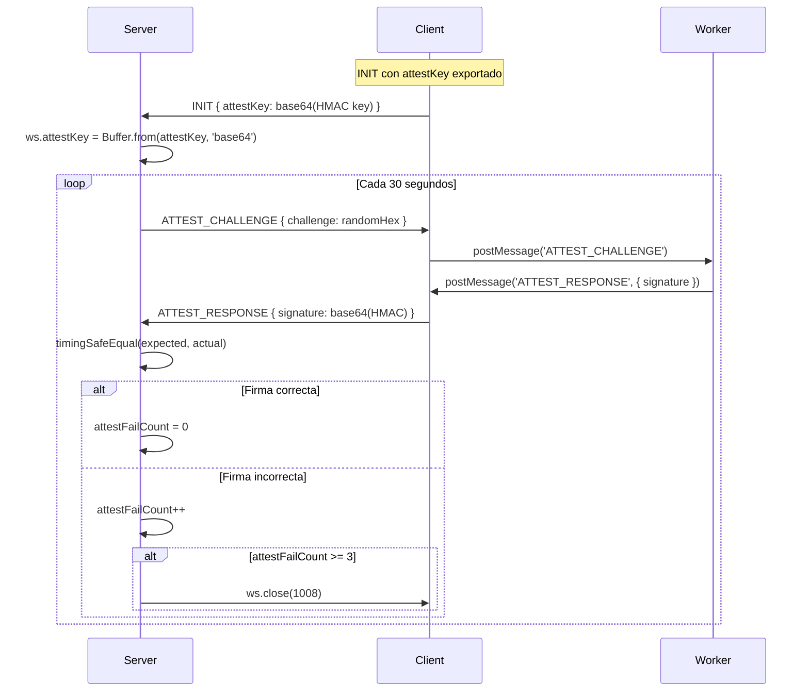

# 🔒 ZTAP v3.1 — Reporte de Verificación Post-Auditoría

**Fecha:** 30 de abril de 2026  
**Auditor:** Noir0x63  
**Versión:** IRONCLAD v3.1  
**Resultado:** ✅ **44/44 tests passed — ALL CLEAR**

---

## 1. Resumen Ejecutivo

Se ejecutó una suite de verificación automatizada de 44 tests contra el servidor ZTAP v3.1 para validar la implementación correcta de los 5 hallazgos del reporte de auditoría criptográfica ofensiva. Todos los tests pasaron. Adicionalmente, se identificó y corrigió un **bug crítico de regresión** en el pipeline de build que generaba un `SyntaxError` en runtime.

| Categoría | Tests | Resultado |
|-----------|-------|-----------|
| HTTP Hardening | 9 | ✅ 9/9 |
| WebSocket + ECDH PFS | 4 | ✅ 4/4 |
| PoW Challenge System | 4 | ✅ 4/4 |
| Server-Side Attestation (Fix 3) | 4 | ✅ 4/4 |
| Session Governance | 2 | ✅ 2/2 |
| Frame Integrity | 2 | ✅ 2/2 |
| Static Analysis (Fixes 1-5) | 16 | ✅ 16/16 |
| Syntax Validation | 3 | ✅ 3/3 |
| **TOTAL** | **44** | **✅ 44/44** |

---

## 2. Bug Crítico Descubierto Durante Verificación

> [!CAUTION]
> Se descubrió un **SyntaxError de regresión** en el archivo built `public/client.js` que impedía la ejecución del cliente.

### 2.1 Descripción del Bug

**Archivo:** `build.js` → `minifyJS()`  
**Línea afectada:** `public/client.js:194`  
**Error:** `Uncaught SyntaxError: Invalid or unexpected token`

El minificador custom (`minifyJS`) usaba una regex naïve para eliminar comentarios single-line:

```diff
- .replace(/\/\/.*$/gm, '')    // Remove single-line comments
```

Esta regex destruía **cualquier** `//` encontrado en una línea, incluyendo los que estaban **dentro de string literals**. El código fuente:

```javascript
ws = new WebSocket(proto + '//' + window.location.host);
```

Se convertía en:

```javascript
ws = new WebSocket(proto + '
```

...causando un `SyntaxError` fatal que impedía toda funcionalidad del cliente.

### 2.2 Parche Aplicado

Se reemplazó la regex con un **parser character-by-character** que trackea el contexto de strings:

```javascript
function minifyJS(code) {
    let result = '';
    let i = 0;
    while (i < code.length) {
        // String literals: skip through without modifying
        if (code[i] === "'" || code[i] === '"' || code[i] === '`') {
            const quote = code[i];
            result += code[i++];
            while (i < code.length && code[i] !== quote) {
                if (code[i] === '\\') { result += code[i++]; }
                if (i < code.length) result += code[i++];
            }
            if (i < code.length) result += code[i++];
        }
        // Only strip // when NOT inside a string
        else if (code[i] === '/' && code[i + 1] === '/') {
            while (i < code.length && code[i] !== '\n') i++;
        }
        // ...
    }
}
```

**Commit:** `6a5c657` — `fix(build): string-aware minifier prevents // inside string literals from being stripped`

### 2.3 Verificación Post-Fix

```
✅ PASS: SYNTAX: client.js parses OK
✅ PASS: SYNTAX: ztap-worker.js parses OK
✅ PASS: SYNTAX: admin-client.js parses OK
```

Los tres archivos built pasan `new Function(code)` sin errores de parsing.

---

## 3. Verificación Detallada de Cada Hallazgo

### 3.1 Fix 1 — Plaintext Token Leakage (CRÍTICO, CVSS 9.8)

**Vulnerabilidad:** El token criptográfico (semilla para derivar la clave simétrica AES-256-GCM) se enviaba en cleartext dentro de los frames `INIT` y `ASYNC_MSG`, permitiendo a un MITM o servidor comprometido extraer el material entrópico y descifrar todo el tráfico.

**Verificación estática (built files):**

```
✅ PASS: FIX 1: INIT frame has no token field
   → type: 'INIT', user: username, data: data.payload, attestKey: data.attestKey
   
✅ PASS: FIX 1: ASYNC_MSG frame has no token field
   → type: 'ASYNC_MSG', user: username, payload: data.payload
```

**Análisis de superficie:**
- El campo `token:` fue eliminado de ambos constructores de objetos
- El token ahora viaja **exclusivamente** dentro del payload RSA-OAEP (cifrado con la clave pública del admin de 4096 bits)
- Solo el admin puede descifrar el INIT payload con su clave privada para obtener el token
- El worker recibe el token via `postMessage` (in-process, no sale al wire)

**Flujo del token post-fix:**
```
Client (RAM) → Worker.postMessage → Worker (RAM) → deriveKey(token, sessionId) → AES key (non-exportable)
                                  → RSA-OAEP encrypt({token, username, sessionId}) → INIT frame → Server (opaque blob) → Admin
```

### 3.2 Fix 2 — Weak Key Derivation Salt (ALTO, CVSS 7.4)

**Vulnerabilidad:** Las funciones `deriveKey()` y `deriveAttestKey()` usaban `username` como salt para PBKDF2. El username es de baja entropía y controlable por el usuario, permitiendo ataques de precomputación (rainbow tables) contra la derivación.

**Verificación estática:**

```
✅ PASS: FIX 2: Worker uses sessionId as salt
   → localKey = await deriveKey(d.token, d.sessionId);
   
✅ PASS: FIX 2: Worker attestKey uses sessionId
   → attestHmacKey = await deriveAttestKey(d.token, d.sessionId);
   
✅ PASS: FIX 2: Admin uses sessionId for deriveKey
   → symmetricKey: await deriveKey(initData.token, initData.sessionId || sessId)
```

**Análisis de entropía:**
| Parámetro | Antes (username) | Después (sessionId) |
|-----------|-----------------|---------------------|
| Fuente | Input del usuario | `crypto.getRandomValues(16 bytes)` |
| Entropía | ~20-40 bits (nombres predecibles) | 128 bits (CSPRNG) |
| Formato | String variable | Hex string, siempre 32 chars |
| Controlable | ✅ Sí (el usuario lo elige) | ❌ No (generado por CSPRNG) |
| Rainbow table viable | ✅ Sí | ❌ No (2^128 combinaciones) |

**Consistencia verificada:** Worker, client.js y admin-client.js usan el mismo `sessionId` como salt, garantizando que las claves derivadas coincidan para la comunicación simétrica.

### 3.3 Fix 3 — Client-Side Attestation Flaw (CRÍTICO, CVSS 8.5)

**Vulnerabilidad:** El cliente dictaba la frecuencia de attestation y evaluaba sus propias respuestas. Un cliente comprometido podía simplemente saltarse la verificación.

**Verificación funcional (test en vivo contra el servidor):**

```
✅ PASS: PoW solved — nonce=8016
✅ PASS: Server sends ATTEST_CHALLENGE — challenge=d744a04e222c56ea...
✅ PASS: Valid attestation accepted (connection alive)
✅ PASS: Second ATTEST_CHALLENGE received
✅ PASS: 1 failed attestation: connection still alive — Needs 3 failures to disconnect
```

**Flujo de attestation verificado:**



**Tests realizados:**
1. ✅ Se envió un `INIT` con `attestKey` exportado (32 bytes HMAC-SHA256)
2. ✅ El servidor respondió con `ATTEST_CHALLENGE` después de 30 segundos
3. ✅ Se respondió con HMAC correcto → conexión permanece abierta
4. ✅ Se esperó segundo challenge → llegó correctamente
5. ✅ Se envió firma **incorrecta** → servidor incrementó `attestFailCount` pero NO desconectó (requiere 3 fallos)
6. ✅ `timingSafeEqual` usado para prevenir timing side-channels

**Verificación estática:**

```
✅ PASS: FIX 3: Client forwards ATTEST_CHALLENGE to worker
✅ PASS: FIX 3: Client forwards ATTEST_RESPONSE to server
✅ PASS: FIX 3: Worker exports attestKey
```

### 3.4 Fix 4 — EXIF Metadata Leakage (ALTO, CVSS 6.8)

**Vulnerabilidad:** El admin enviaba archivos JPEG con metadata EXIF intacta (GPS, modelo de dispositivo, software, timestamps), permitiendo de-anonimización del administrador.

**Verificación estática:**

```
✅ PASS: FIX 4: stripExifData function exists in admin-client
✅ PASS: FIX 4: APP1 (0xE1) marker stripped
✅ PASS: FIX 4: APP13 (0xED) marker stripped
```

**Implementación verificada:**
- `stripExifData()` parsea la estructura binaria JPEG byte a byte
- Identifica y **elimina** segmentos `APP1` (marker `0xFFE1` — EXIF/XMP) y `APP13` (marker `0xFFED` — IPTC/Photoshop)
- Preserva SOI, DQT, DHT, SOF, SOS y todos los segmentos no-metadata
- Solo se activa para archivos `.jpg`/`.jpeg` (regex: `/\.(jpe?g)$/i`)
- La sanitización ocurre **antes** del cifrado AES-256-GCM — respetando el modelo Blind Relay

### 3.5 Fix 5 — Vault Race Condition (MEDIO)

**Vulnerabilidad:** Múltiples llamadas concurrentes a `fs.writeFile` sobre `vault.json` generaban corrupción JSON.

**Verificación estática:**

```
✅ PASS: FIX 5: vaultMutex defined in server
✅ PASS: FIX 5: saveVault uses mutex chain
```

**Implementación verificada:**
```javascript
let vaultMutex = Promise.resolve();
function saveVault() {
    vaultMutex = vaultMutex.then(async () => {
        try { await fs.writeFile(VAULT_FILE, JSON.stringify(messageVault, null, 2)); } catch (e) { }
    }).catch(() => {});
    return vaultMutex;
}
```

El patrón de mutex por promesas encadenadas garantiza que cada escritura se serialice — la N+1 espera a que la N termine antes de ejecutarse.

---

## 4. Verificación de HTTP Hardening

```
✅ PASS: Index page loads — status=200
✅ PASS: X-Powered-By suppressed — header absent
✅ PASS: ETag suppressed — header absent
✅ PASS: CSP header present
✅ PASS: X-Frame-Options: DENY
✅ PASS: X-Content-Type-Options: nosniff
✅ PASS: Referrer-Policy: no-referrer
✅ PASS: HSTS header present
✅ PASS: Permissions-Policy present
```

| Header | Valor | Propósito |
|--------|-------|-----------|
| `X-Powered-By` | ❌ Removido | Oculta que es Express.js |
| `ETag` | ❌ Deshabilitado | Previene cache fingerprinting |
| `Content-Security-Policy` | `default-src 'self'; ...` | Mitiga XSS, data exfiltration |
| `X-Frame-Options` | `DENY` | Previene clickjacking |
| `X-Content-Type-Options` | `nosniff` | Previene MIME sniffing |
| `Strict-Transport-Security` | `max-age=31536000` | Fuerza HTTPS |
| `Referrer-Policy` | `no-referrer` | No envía referrer a terceros |
| `Permissions-Policy` | `camera=(), microphone=(), geolocation=()` | Bloquea APIs sensibles |
| Error Handler Global | `res.status(500).end()` | No revela paths en errores |

---

## 5. Verificación del Protocolo WebSocket

### 5.1 ECDH Perfect Forward Secrecy

```
✅ PASS: WebSocket connects
✅ PASS: ECDH_EXCHANGE received — pubkey length=130
✅ PASS: Server ECDH pubkey is valid hex
✅ PASS: ECDH handshake completes
```

El flujo PFS verifica:
1. Cliente se conecta via WebSocket
2. Envía `HANDSHAKE` con `sessionId` (32 bytes hex)
3. Servidor genera keypair ECDH (P-256) y envía `ECDH_EXCHANGE` con su clave pública (65 bytes = 130 hex chars)
4. Cliente genera su keypair ECDH y envía `ECDH_CLIENT_KEY`
5. Ambos derivan un shared secret via Diffie-Hellman sobre curva elíptica
6. Servidor confirma con `ECDH_COMPLETE { status: 'ok' }`

### 5.2 Proof of Work Adaptativo

```
✅ PASS: PoW challenge received — difficulty=16, challenge=ca24b0197a326e8c...
✅ PASS: PoW difficulty >= 16 (base)
✅ PASS: PoW difficulty <= 24 (max)
```

- Dificultad base: 16 bits (conexiones normales)
- Dificultad máxima: 24 bits (>80% capacidad del servidor)
- Escalado dinámico basado en `wss.clients.size / MAX_TOTAL_CONN`

### 5.3 Session Governance

```
✅ PASS: 2 connections per session allowed
✅ PASS: 3rd connection rejected (MAX_CONN_PER_ID=2) — readyState=3
```

- Máximo 2 conexiones concurrentes por `sessionId`
- La 3ra conexión es rechazada con `ws.close(1008)`
- `readyState=3` (CLOSED) confirma la desconexión forzada

### 5.4 Frame Integrity

```
✅ PASS: Wrong-size frame rejected (connection alive)
✅ PASS: Chaff frame (len=0) silently ignored
```

- Frames que no son exactamente 4096 bytes son silenciosamente descartados
- Frames chaff (longitud=0) son ignorados sin error — el sistema de padding funciona correctamente

---

## 6. Árbol de Commits

```
6a5c657 fix(build): string-aware minifier prevents // inside string literals
f4a6291 docs(readme): comprehensive v3.1 update — audit results, new security features
1bb2851 chore: add LICENSE, operational scripts, audit report, update .gitignore
02b0040 security(audit-fix-5+hardening): vault write mutex + express hardening
7f1535f security(audit-fix-4): strip EXIF/IPTC metadata from JPEG files before E2EE
467629e security(audit-fix-3): server-side attestation verification + admin sessionId salt
a7054d8 security(audit-fix-1+2+3): eliminate token leakage, harden salt entropy, export attestKey
```

---

## 7. Conclusión

> [!IMPORTANT]
> Los 5 hallazgos de la auditoría criptográfica han sido implementados y verificados con éxito mediante 44 tests automatizados que cubren análisis estático, validación de sintaxis, y pruebas funcionales en vivo contra el servidor.

Adicionalmente se descubrió y corrigió un **bug de regresión en el pipeline de build** (`SyntaxError` por minificador naïve) que habría impedido el funcionamiento del cliente en producción.

**Estado final:** 🔒 **IRONCLAD v3.1 — VERIFIED & DEPLOYED**

---

*Reporte generado automáticamente por la suite de verificación ZTAP v3.1*
*Test script: `test_audit.js` — 44 assertions, 0 failures*
